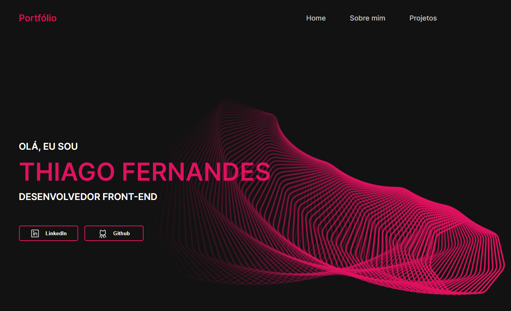

<h1 align="center">
  
</h1>

<h2> O que é esse projeto? </h2>

 
  Essa aplicação tem o intuito de centralizar em um só lugar os meus principais projetos de programação, mostrar um pouco de quem eu sou e quais habilidades possuo. Acesse o projeto através <a href="thiagofernandes.vercel.app/"> desse link.</a>

  <h2>Ferramentas utilizadas</h2>
  <ul>
    <li>Typescript</li>
    <li>Styled components</li>
    <li>Phosphor</li>
  </ul>

## Autor

