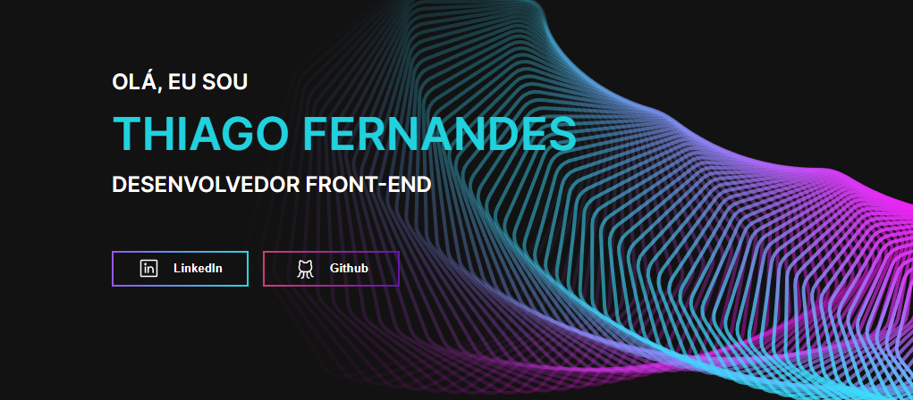

<h1 align="center">
  
  
Portfólio

</h1>

<h2> O que é esse projeto? </h2>

 
  É uma aplicação com o intuito de apresentar minhas habilidades, mostrar um pouco de quem sou eu
  e destacar os meus principais projetos de programação

  <h2>Ferramentas utilizadas (versão Mobile)</h2>
  <ul>
    <li>Typescript</li>
    <li>Styled components</li>
    <li>Phosphor</li>
  </ul>

## Autor

